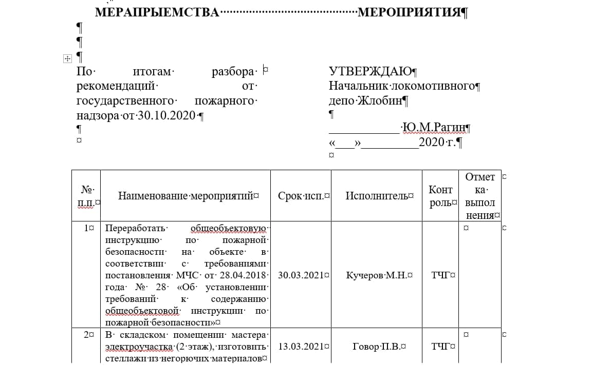

# CPD (Control of performance discipline)
## __Документация__
Программа на вход получает файл с расширением _doc_, _docx_.\
Файл состоит из таблицы с 6 столбцами:
+ порядковый номер;
+ наименование мероприятий;
+ срок исполнения;
+ исполнитель;
+ контроль;
+ отметка выполнения.
### Образец

___
## __Функционал__
1. При получении текстового файла программа рассылает файл на электронную почту всем причастным по графам `исполнитель`, `контроль`.
2. По графе `срок исполнения` отслеживает количество календарных дней:
    + за три дня до окончания срока исполнения напоминает `исполнителю` и поторно высылает на электронную почту конкретную строку мероприятий;
    + за сутки напоминает `исполнителю`, а также  `контролирующему` и повторно высылает на электронную почту конкретную строку мероприятий;
    + при срыве сроков программа формирует иформацию по каждому мероприятию и выполняет рассылку на электронную почту руководству предприятия.
  ___
  [PyLounge VK](https://vk.com/id101769482)

